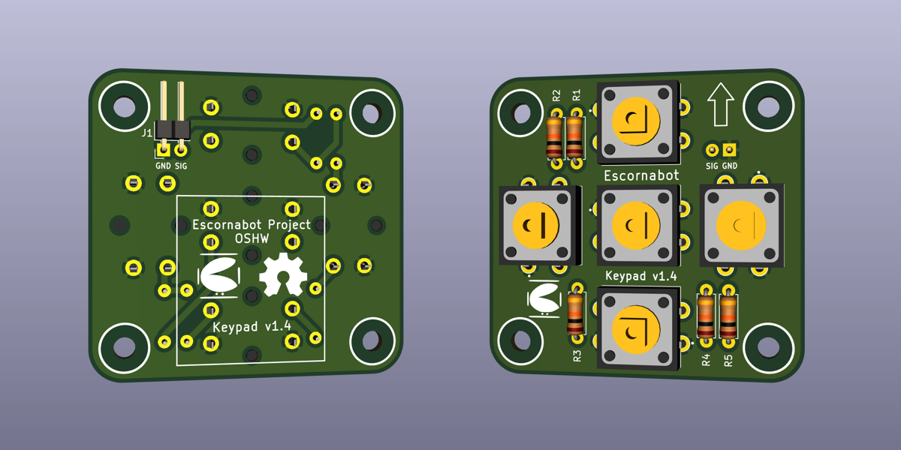

# Escornabot keypad
My own implementation of a keypad for the [Escornabot](https://escornabot.org) educational bot. Firstly created in May-2018 has now been updated, improved and published.

An opensource hardware project developed with and opensource EDA: [KiCAD EDA 5.1](https://www.kicad.org/)

## Manufacturing
If you just want to get your PCBs done, use the [gerber file](gerber.zip) with any of the PCB manufactures around the globe like:

* [JLCPcb](https://jlcpcb.com) (note that my PCB has already markings for this provider)
* [PCBWay](https://pcbway.com)
* [OSHPark](https://oshpark.com)
* [many, many others ...](https://duckduckgo.com/?q=pcb+manufacturers)

**NOTE:** approximate board dimensions 48 x 46 mm, 2 layers, 1.6 mm thickness 

## Fritzing
There's available a [fritzing part](https://github.com/mgesteiro/fritzing-parts/tree/main/EscornaKeypad) for this design:

## LICENSE
This work describes Open Hardware and is licensed under the [CERN-OHL-S v2 license](LICENSE_CERNSV20). It is distributed WITHOUT ANY EXPRESS OR IMPLIED WARRANTY, INCLUDING OF MERCHANTABILITY, SATISFACTORY QUALITY AND FITNESS FOR A PARTICULAR PURPOSE. Please see the [CERN-OHL-S v2](https://ohwr.org/cern_ohl_s_v2.txt) for applicable conditions.

All media and data files that are not part of the hardware design are licensed under the [Creative Commons Attribution 4.0 BY-SA license](LICENSE-CCBYSA40).

More information about licenses in [CERN openhardware licenses](https://ohwr.org/project/cernohl/wikis/Documents/CERN-OHL-version-2), [Opensource licenses](https://opensource.org/licenses/) and [Creative Commons licenses](https://creativecommons.org/licenses/).
